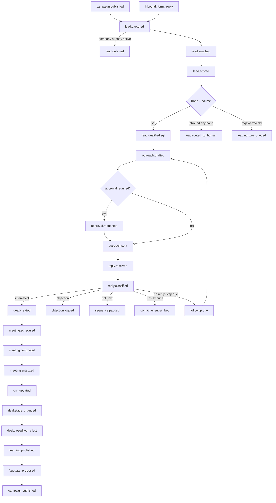

# Event Catalog

**Status:** architecture phase, deliverable 3. Feeds `schemas/events/*.json`,
`orchestrator/router.py`, and all eight agent contracts (deliverable 4).

This is the system spine. Every agent's inputs and outputs are defined here. If an
agent needs data that no event carries and no table holds, that is a design gap —
surface it rather than adding a direct call between agents.

---

## 1. Foundational rules

### R1 — Events are facts, jobs are work
This distinction is the most common thing implementers get wrong. They are two
different tables with two different purposes:

| | `events` | `jobs` |
|---|---|---|
| Means | "This happened." Past tense. Immutable. | "Do this." Imperative. Consumed. |
| Example | `lead.scored` | `score_lead` |
| Consumers | Zero or many (fan-out) | Exactly one worker |
| Retried? | Never — the fact already happened | Yes, with backoff |
| Deleted? | Never (audit log) | Archived after completion |

Flow: something happens → **event** is written to the outbox → the router reads it and
enqueues one or more **jobs** → a worker runs a handler → the handler writes new events.

**Never name an event as a command.** There is no `send.email` event. There is a
`send_email` job, and afterwards an `outreach.sent` event.

### R2 — Payloads carry identifiers plus minimal context, never whole entities
A payload contains the IDs needed to act and only the denormalised fields needed for
routing decisions. Handlers re-read current state from the database. Fat payloads go
stale between emission and processing and become a second, wrong source of truth.

### R3 — Every event uses the same envelope
```json
{
  "event_id": "uuid",
  "type": "lead.scored",
  "version": 1,
  "occurred_at": "2026-07-23T09:14:00Z",
  "actor": "agent:qualification",
  "correlation_id": "uuid",
  "causation_id": "uuid",
  "idempotency_key": "string",
  "payload": { }
}
```
- `correlation_id` — constant across an entire lead's lifetime. This is what makes a
  full journey traceable in Langfuse and in SQL.
- `causation_id` — the `event_id` that caused this one. Gives you the causal chain.
- `idempotency_key` — natural key for the fact (e.g. `lead:{id}:scored:{run_id}`).
  Unique index on it. Re-emission is a no-op, which makes webhook replay safe.

`schemas/events/_envelope.json` defines this once; every event schema references it
and defines only its `payload`.

### R4 — Naming: `<entity>.<past-tense-verb>`, lowercase, dot-separated
Sub-typed outcomes use a third segment (`lead.qualified.sql`, `deal.closed.won`) so
the router can subscribe to a prefix.

### R5 — Versioning
`version` starts at 1. Additive changes (new optional field) do not bump it. Removing
or re-meaning a field bumps it, and the old version's schema file is retained. Never
silently change what a field means.

---

## 2. Domain flow (the business story)



---

## 3. Phase 1 events — Revenue path

### `campaign.published`
**Emitted by** Marketing (Phase 4) or a human via API. **Consumed by** Lead Generation.
```json
{ "campaign_id": "uuid", "industry_pack": "string", "channel": "email",
  "sequence_key": "string", "target_audience": { "filters": {} } }
```

### `lead.captured`
**Emitted by** API webhook (form), manual import script, or discovery job.
**Consumed by** Lead Generation.
```json
{ "lead_id": "uuid", "contact_id": "uuid", "company_id": "uuid|null",
  "campaign_id": "uuid|null", "source": "webform|manual_import|discovery|referral|inbound_reply",
  "industry_pack": "string" }
```
Idempotency: `lead:{contact_id}:{campaign_id|manual}:captured`.

### `lead.deferred` ← **required by the single-threaded rule**
**Emitted by** Lead Generation when the target company already has an active lead and
the unique constraint blocks creation. **Consumed by** the deferred-queue scheduler.

This is a normal outcome, not an error. The lead row is created with
`status = 'deferred'` (add to the status enum) and no `first_touched_at`. A scheduled
job re-evaluates deferred leads when the blocking lead resolves.
```json
{ "lead_id": "uuid", "company_id": "uuid", "blocked_by_lead_id": "uuid",
  "reason": "company_single_thread" }
```
**Implementation note:** the constraint violation must be caught and converted to this
event. Do not let it surface as an unhandled `UniqueViolation`.

### `lead.enriched`
**Emitted by** Lead Generation. **Consumed by** Qualification.
```json
{ "lead_id": "uuid", "contact_id": "uuid", "company_id": "uuid",
  "fields_enriched": ["industry","employee_band","seniority"],
  "email_status": "valid", "run_id": "uuid" }
```

### `lead.enrichment_failed`
**Emitted by** Lead Generation after retries. **Consumed by** human review queue.
```json
{ "lead_id": "uuid", "reason": "no_domain|provider_error|email_invalid",
  "attempts": 3, "last_error": "string" }
```

### `lead.scored`
**Emitted by** Qualification. **Consumed by** router (for band decision), Learning (later).
```json
{ "lead_id": "uuid", "score_id": "uuid", "total": 82.5, "band": "sql",
  "deterministic_part": 51.0, "llm_part": 31.5,
  "industry_pack": "string", "prompt_version": 3, "run_id": "uuid" }
```

### `lead.qualified.{cold|warm|mql|sql}`
**Emitted by** Qualification. **Consumed by** Sales (sql only), nurture (mql/warm), none (cold).
```json
{ "lead_id": "uuid", "band": "sql", "total": 82.5, "campaign_id": "uuid|null",
  "source": "discovery" }
```

### `lead.routed_to_human` ← **R2 inbound rule**
**Emitted by** Qualification when `source ∈ {webform, inbound_reply, referral}`,
regardless of band. **Consumed by** Slack notifier.

The lead is still scored (Learning needs the comparison) but bypasses the SQL gate.
```json
{ "lead_id": "uuid", "band": "warm", "total": 61.0, "source": "webform",
  "reason": "inbound_bypass" }
```

### `outreach.drafted`
**Emitted by** Sales. **Consumed by** approval gate or send job.
```json
{ "lead_id": "uuid", "draft_id": "uuid", "sequence_step": 0,
  "requires_approval": true, "prompt_version": 3, "run_id": "uuid" }
```

### `outreach.sent`
**Emitted by** Sales after a successful Gmail send. **Consumed by** sequence scheduler, CRM sync.
```json
{ "lead_id": "uuid", "message_id": "uuid", "provider_message_id": "string",
  "thread_id": "string", "sequence_step": 0, "campaign_id": "uuid|null",
  "approval_id": "uuid|null", "sent_at": "timestamp" }
```
Idempotency: `message:{provider_message_id}:sent`.

### `outreach.blocked`
**Emitted by** the send path when a gate refuses. **Consumed by** ops notifier.
```json
{ "lead_id": "uuid", "draft_id": "uuid",
  "reason": "daily_cap_reached|suppressed_contact|missing_approval|dev_sandbox" }
```
Every refusal is observable. A blocked send must never fail silently.

### `reply.received`
**Emitted by** the Gmail webhook route or the reconciliation job. **Consumed by** Sales.
```json
{ "lead_id": "uuid|null", "contact_id": "uuid|null", "message_id": "uuid",
  "provider_message_id": "string", "thread_id": "string" }
```
Idempotency: `message:{provider_message_id}:received`. This key is what makes the
webhook and the reconciliation job safe to both deliver the same message.

### `reply.classified`
**Emitted by** Sales. **Consumed by** router → branches to deal / objection / pause / unsubscribe.
```json
{ "lead_id": "uuid", "message_id": "uuid",
  "intent": "interested|objection|not_now|unsubscribe|out_of_office|referral|unclear",
  "confidence": 0.91, "objection_category": "price|null",
  "suggested_action": "book_meeting", "prompt_version": 2, "run_id": "uuid" }
```
Low confidence (below config threshold) routes to human review rather than acting.

### `followup.due` / `sequence.paused` / `sequence.completed`
**Emitted by** the sequence scheduler / Sales. **Consumed by** Sales / CRM sync.
```json
{ "lead_id": "uuid", "sequence_run_id": "uuid", "step": 2,
  "reason": "reply_received|manual|steps_exhausted" }
```

### `objection.logged`
**Emitted by** Sales or Meeting Intelligence. **Consumed by** Learning.
```json
{ "objection_id": "uuid", "lead_id": "uuid", "deal_id": "uuid|null",
  "category": "price", "source": "email|meeting", "ref_id": "uuid" }
```
`category` is a closed enum from config — never model-invented (entity model §3.9).

### `contact.unsubscribed`
**Emitted by** the unsubscribe route or reply classification. **Consumed by** CRM sync (suppression).
```json
{ "contact_id": "uuid", "lead_id": "uuid|null", "method": "link|reply|manual" }
```
Terminal. Sets `email_status = 'suppressed'`; the send path checks this every time.

### `deal.created` ← **R3 trigger**
**Emitted by** Sales on first positive engagement (intent `interested`, or a meeting
booked). **Not** on SQL classification. **Consumed by** CRM sync.
```json
{ "deal_id": "uuid", "lead_id": "uuid", "contact_id": "uuid", "company_id": "uuid",
  "trigger": "positive_reply|meeting_booked", "currency": "USD" }
```

### `meeting.requested` / `meeting.scheduled`
**Emitted by** Sales. **Consumed by** calendar integration / CRM sync.
```json
{ "lead_id": "uuid", "deal_id": "uuid|null", "meeting_id": "uuid",
  "external_event_id": "string", "scheduled_at": "timestamp" }
```

---

## 4. Phase 2 events — Meeting intelligence & CRM

### `meeting.completed`
**Emitted by** calendar webhook or transcript upload. **Consumed by** Meeting Intelligence.
```json
{ "meeting_id": "uuid", "deal_id": "uuid|null", "lead_id": "uuid",
  "transcript_available": true, "occurred_at": "timestamp" }
```

### `meeting.analyzed`
**Emitted by** Meeting Intelligence. **Consumed by** CRM sync, Learning.
```json
{ "meeting_id": "uuid", "insight_id": "uuid", "deal_id": "uuid|null",
  "deal_health_score": 72, "action_item_count": 4,
  "objections_found": ["price","timing"], "competitors_mentioned": ["string"],
  "urgency": "high|medium|low", "prompt_version": 1, "run_id": "uuid" }
```

### `crm.updated`
**Emitted by** CRM sync. **Consumed by** none in v1 (audit + external adapters later).
```json
{ "entity_type": "contact|company|deal|lead", "entity_id": "uuid",
  "changes": ["stage","health_score"], "actor": "agent:meeting_intel" }
```

### `crm.merge_proposed`
**Emitted by** CRM sync dedup when confidence is ambiguous. **Consumed by** approval flow.
```json
{ "entity_type": "company|contact", "primary_id": "uuid", "duplicate_id": "uuid",
  "confidence": 0.78, "evidence": { "matched_on": ["fuzzy_name","shared_domain"] } }
```
**Note (single-threaded consequence):** duplicate company records defeat the
one-active-lead-per-company constraint, because two rows are two `company_id`s.
Company dedup is therefore load-bearing, not cosmetic. Merges above the config
threshold still require approval; deletion always does.

### `deal.stage_changed`
**Emitted by** CRM sync. **Consumed by** Learning, notifier.
```json
{ "deal_id": "uuid", "from_stage": "string", "to_stage": "string",
  "reason": "meeting_analyzed|manual|reply_classified" }
```

### `deal.closed.{won|lost}`
**Emitted by** CRM sync / human action. **Consumed by** Learning (single-deal analysis).
```json
{ "deal_id": "uuid", "lead_id": "uuid", "outcome": "won",
  "value_amount": 12000.00, "currency": "EUR",
  "value_base_amount": 12960.00, "fx_rate_to_base": 1.08, "fx_frozen_at": "timestamp",
  "lost_reason": "string|null", "cycle_days": 34 }
```
FX is frozen at emission (entity model §8.2). The payload carries base amount so
downstream consumers never re-convert.

---

## 5. Phase 3 events — Learning

### `learning.published`
**Emitted by** Learning (weekly job or on `deal.closed.*`). **Consumed by** Marketing, humans.
```json
{ "learning_id": "uuid", "scope": "weekly|deal", "period_start": "date",
  "period_end": "date", "finding_count": 6,
  "recommendation_types": ["messaging","icp","sequence"],
  "evidence_deal_ids": ["uuid"], "run_id": "uuid" }
```

### `messaging.update_proposed` / `icp.update_proposed` / `sequence.update_proposed`
**Emitted by** Learning or Market Intelligence. **Consumed by** approval flow, then Marketing.
```json
{ "proposal_id": "uuid", "kind": "icp", "industry_pack": "string",
  "diff": { "before": {}, "after": {} }, "rationale": "string",
  "evidence": { "deal_ids": ["uuid"], "sample_size": 24 },
  "requires_approval": true }
```
**Never auto-applied.** ICP changes alter scoring for every future lead, so they are
always gated (build-spec §4.7).

---

## 6. Phase 4 events — Marketing brain

### `market.insight_published`
```json
{ "insight_id": "uuid", "industry_pack": "string",
  "kind": "trend|competitor|audience", "summary": "string",
  "sources": ["url"], "run_id": "uuid" }
```

### `campaign.assets_created`
```json
{ "campaign_id": "uuid", "asset_ids": ["uuid"],
  "kinds": ["email_sequence","linkedin_post","blog_outline"] }
```

---

## 7. Operational events (plumbing)

Separate from domain events because they describe the system, not the business.
Consumed by the ops notifier and observability, never by domain agents.

| Event | Emitted when | Payload core |
|---|---|---|
| `approval.requested` | A gated action needs a human | `approval_id, action_type, lead_id?, expires_at` |
| `approval.granted` | Human approves | `approval_id, decided_by, token` |
| `approval.denied` | Human rejects | `approval_id, decided_by, reason` |
| `approval.expired` | TTL passes with no decision | `approval_id, action_type` |
| `job.dead_lettered` | Job exhausts retries | `job_id, job_type, attempts, last_error` |
| `llm.validation_failed` | Output fails schema twice | `prompt_id, prompt_version, run_id, errors` |
| `agent.run_failed` | Handler raises | `agent, event_type, run_id, error` |
| `integration.degraded` | External API failing | `service, error_rate, window` |

### 7.1 Approval expiry policy (resolved 2026-07-23)

Expiry behaviour is per action type, not global. Principle: **cancel things that go
stale, escalate things that are commitments.** Cancelling an outreach draft is not a
loss — the lead requeues and is redrafted with fresh context, which is strictly better
than sending three-week-old "I saw you just launched X" copy.

| action_type | on_expiry | ttl | escalation |
|---|---|---|---|
| outreach_draft | cancel → requeue lead | 72h | slack, then digest |
| sequence_step | cancel → pause sequence | 72h | slack, then digest |
| proposal_send | escalate (never cancel) | 24h | slack, then daily |
| pricing_discount | escalate (never cancel) | 24h | slack, then daily |
| campaign_launch | escalate | 7d | slack, then digest |
| icp_update | escalate | 14d | digest |
| crm_merge | escalate | 7d | digest |
| record_delete | escalate (never cancel) | none | slack, then daily |

Lives in `config/thresholds.yaml` under `approvals.expiry`. Cancellation emits
`approval.expired` with `action_taken: "cancelled"` and the affected lead returns to
its prior status; escalation emits with `action_taken: "escalated"` and re-notifies.

**The daily digest is the real safety net.** A single missed Slack ping is invisible;
a daily "4 approvals waiting, oldest 6 days" is not. Digest runs on schedule from
`orchestrator/schedules.py` and fires even when the queue is empty for the first week
so its absence is noticeable.

### 7.2 Unmatched replies (resolved 2026-07-23)

When `reply.received` cannot be matched to a lead — reply from a different address,
forwarded colleague, thread id missing — it routes to a **human review queue**, not to
auto-creation of a new lead. Matching order: `thread_id` → `provider_message_id`
in-reply-to chain → contact email → unmatched. Unmatched emits
`reply.unmatched` (payload: `message_id`, `from_email`, `thread_id`, `attempted_matches`)
consumed by the Slack notifier. A human links it to a lead or discards it.

Revisit only if the queue proves noisy in practice.

---

## 8. Emitter → consumer matrix

| Event | Emitter | Consumers |
|---|---|---|
| campaign.published | marketing / human | leadgen |
| lead.captured | api / script / leadgen | leadgen |
| lead.deferred | leadgen | scheduler |
| lead.enriched | leadgen | qualification |
| lead.enrichment_failed | leadgen | ops notifier |
| lead.scored | qualification | router, learning |
| lead.qualified.sql | qualification | sales |
| lead.qualified.{mql,warm} | qualification | nurture (Phase 4) |
| lead.routed_to_human | qualification | slack notifier |
| outreach.drafted | sales | approvals / send job |
| outreach.sent | sales | sequence scheduler, crm_sync |
| outreach.blocked | send path | ops notifier |
| reply.received | api webhook / reconciler | sales |
| reply.classified | sales | router |
| deal.created | sales | crm_sync |
| objection.logged | sales / meeting_intel | learning |
| contact.unsubscribed | api / sales | crm_sync |
| meeting.scheduled | sales | crm_sync |
| meeting.completed | webhook / upload | meeting_intel |
| meeting.analyzed | meeting_intel | crm_sync, learning |
| crm.updated | crm_sync | — |
| crm.merge_proposed | crm_sync | approvals |
| deal.stage_changed | crm_sync | learning, notifier |
| deal.closed.* | crm_sync / human | learning |
| learning.published | learning | marketing, humans |
| *.update_proposed | learning / market_intel | approvals → marketing |
| market.insight_published | market_intel | marketing |
| campaign.assets_created | marketing | humans |

**Verification rule:** every agent in deliverable 4 must have at least one consumed
event and at least one emitted event in this table. An agent with no emissions is a
dead end; an agent with no consumption is unreachable.

---

## 9. Implementation notes for the coding agent

1. `schemas/events/_envelope.json` first, then one file per event above.
2. `core/events.py::emit()` validates against the event's schema *before* insert and
   refuses unknown types. A typo in an event name must fail loudly, not create a new
   event type by accident.
3. `orchestrator/router.py` is the single mapping from event type → job(s). It is a
   dict, not a chain of `if` statements. Prefix subscription (`lead.qualified.*`)
   supported.
4. Unique index on `events.idempotency_key`. Re-emission is a no-op, not an error.
5. `correlation_id` propagates: a handler emitting a new event copies the
   `correlation_id` of the event it was handling and sets `causation_id` to that
   event's `event_id`.
6. Constraint violations that represent business outcomes (`lead.deferred`) are caught
   and converted to events. Only genuine faults raise.